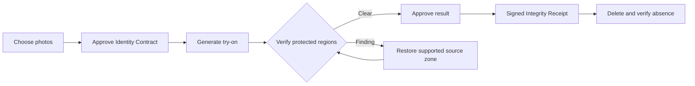
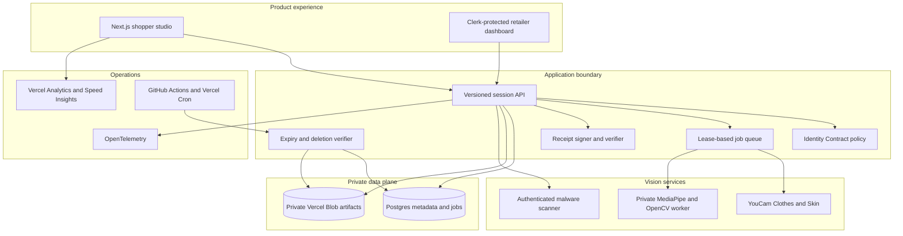

# KeepMe — Change the Clothes, Not the Person

[](https://nodejs.org/)
[](https://nextjs.org/)
[](https://www.typescriptlang.org/)
[](https://github.com/ankitlade12/keepme/actions/workflows/ci.yml)
[](https://keepme-olive.vercel.app)

> **A virtual try-on should change the garment—not the shopper.**

KeepMe is a consent and visual-integrity layer for AI apparel try-on. A shopper defines what may change, KeepMe measures what actually changed, and protected-region drift is surfaced before the result can be approved.

The product can restore supported source regions, reverify the repaired result, issue a signed Integrity Receipt, and confirm deletion of the sensitive session artifacts it created.

KeepMe is not identity verification, face recognition, medical analysis, or a guarantee of garment fit. It answers a narrower question: **did the virtual try-on alter anything outside the shopper-approved garment area?**

**Demo data:** entirely synthetic<br>
**Default demo:** deterministic and credential-free<br>
**Hosted product:** [keepme-olive.vercel.app](https://keepme-olive.vercel.app) — guided synthetic demo plus fail-closed live YouCam mode

## Quick Highlights

- **Identity Contract** — a versioned, generation-scoped record of the allowed edit and protected regions
- **Preserve Map** — shopper-drawn zones for glasses, hair, assistive objects, or any detail that must remain unchanged
- **Measured Integrity Evidence** — garment fidelity, outside-region stability, face geometry, skin consistency, silhouette, and preserve-zone checks
- **Hard Failure Rules** — critical protected-region drift cannot be hidden by a high average score
- **Repair and Reverification** — supported source zones can be restored and checked again under the same contract
- **Signed Integrity Receipt** — downloadable JWS evidence binds the approved contract to result digests and the final decision
- **Verified Deletion** — source, garment, generated, repaired, mask, and derived artifacts are deleted and checked for absence
- **Retailer-Safe Operations** — tenant isolation, minimum-cohort analytics, provider credit budgets, rate limits, and privacy-filtered telemetry
- **Fail-Closed Live Mode** — the synthetic demo remains usable, while personal-image processing stays disabled until durable storage, authentication, scanning, signing, cleanup, and vision services are configured

## Product Surfaces

| Surface | Route | Purpose |
|---|---|---|
| Product story | `/` | Shopper value, trust model, and retailer positioning |
| Safe try-on studio | `/studio` | Contract, generation, verification, repair, receipt, and deletion journey |
| Retailer dashboard | `/dashboard` | Authenticated, tenant-scoped quality and usage aggregates |
| Health check | `/api/health` | Runtime, database, and object-storage readiness without secret disclosure |
| Session API | `/api/v1/sessions` | Versioned privacy-first orchestration boundary |
| Receipt verification | `/api/v1/receipts/verify` | Independent signed-receipt verification |
| Public notices | `/privacy`, `/terms`, `/security` | Product privacy, terms, and security language |

The hosted guided path is public and uses only the synthetic assets in [`public/demo`](public/demo/). Live mode is exposed only when its private scanner, integrity worker, durable stores, credentials, and production safety checks are available at runtime.

## Architecture Overview

### The Integrity Loop



The garment edit is expected. KeepMe evaluates the protected pixels and structures around it, explains findings in plain language, and leaves the final decision with the shopper.

### System Architecture



### Technology Stack

| Layer | Technology | Responsibility |
|---|---|---|
| Web and API | Next.js 16, React 19, strict TypeScript | Product UI, API boundary, security headers, and orchestration |
| Authentication | Clerk | Retailer sign-in, allowlisting, and stable organization/user tenant ownership |
| Metadata and jobs | Postgres | Sessions, cleanup leases, usage, rate limits, and privacy-filtered events |
| Sensitive artifacts | Private Vercel Blob | Opaque paths, server-only access, digest evidence, and deletion verification |
| Virtual try-on | YouCam AI Clothes v3 | Server-side garment generation with bounded polling and credit guards |
| Consistency signal | YouCam Skin Analysis v2.1 | Optional source/result skin-signal comparison |
| Integrity worker | FastAPI, MediaPipe, OpenCV | Face-landmark alignment and person segmentation without recognition |
| Upload boundary | Sharp and private ClamAV service | Decode, size/pixel limits, metadata removal, re-encoding, and authenticated malware decision |
| Proof | JOSE, SHA-256, signed JWS | Contract/result binding and receipt verification |
| Operations | OpenTelemetry and Vercel | Structured events, runtime traces, analytics, and performance visibility |

## The Problem

Virtual try-on systems are asked to edit clothing, but generated outputs may also change glasses, hair, skin appearance, facial structure, body outline, or personally meaningful details. A visually convincing image can therefore be wrong in a way that is difficult for a shopper or retailer to explain and impossible to audit later.

Three questions are usually left unanswered:

- What exactly did the shopper authorize the model to change?
- Did the output stay inside that boundary?
- What evidence remains after the image is approved or deleted?

**A plausible result is not the same as a contract-compliant result.**

## The Solution

KeepMe turns one try-on into a governed, session-scoped record:

1. The shopper chooses a person photo and garment.
2. An Identity Contract defines the allowed garment edit and protected regions.
3. The browser records explicit consent for one generation.
4. YouCam creates the apparel result through a server-only adapter.
5. KeepMe aligns source and result, measures protected regions, and applies hard failure rules.
6. Supported findings can be repaired by restoring the selected source zone and reverifying it.
7. The shopper approves the result and receives a signed Integrity Receipt.
8. The session artifacts are deleted immediately or by expiry cleanup, and absence is verified before deletion is reported as complete.

The deterministic guided demo uses this same product flow with a disclosed glasses-removal fixture. It does not pretend that an accidental live-provider failure occurred during the demo.

## Integrity Decision Policy

| State | Meaning |
|---|---|
| `passed` | No protected check crossed its calibrated threshold |
| `needs_review` | A non-critical protected signal requires a shopper decision |
| `failed` | A hard protected-region rule was violated |
| `inconclusive` | Alignment or input quality is not reliable enough to judge |
| `passed_after_repair` | A supported source-zone restoration passed reverification |

Hard rules take precedence over the weighted summary. Skin Analysis is a secondary consistency signal: if it is unavailable, confidence is reduced rather than automatically failed.

## Product Features

### Consent and Identity Contract

- Generation-scoped consent with versioned contract data
- Explicit allowed garment region and individually toggleable protections
- Custom preserve zones drawn directly on the source image
- Contract and consent events bound to the private session

### Verification and Explanation

- Source/result alignment reliability checks
- Garment no-op detection and outside-region comparison
- Face-landmark displacement without identity recognition
- Skin and silhouette consistency signals
- Preserve-zone hard rules, component scores, reason codes, and highlighted findings
- Explicit `inconclusive` outcomes when evidence quality is insufficient

### Repair, Proof, and Deletion

- Feathered source-zone restoration for supported findings
- Reverification after repair under the same contract
- Signed JSON receipt with contract and result digests
- Public receipt-verification endpoint
- Immediate deletion, expiry cleanup, bounded retries, and absence verification

### Retailer and Operational Controls

- Clerk-protected retailer access with exact email allowlisting
- Organization/user tenant isolation and no individual shopper-image view
- Minimum cohort suppression for aggregate analytics
- Per-IP, per-session, and per-tenant provider limits
- Structured operational events that exclude image data, URLs, filenames, and identity attributes

## Recommended 90-Second Demo

The default **Identity drift demo** is synthetic, deterministic, and safe to repeat.

1. Open `/studio` and keep **Identity drift demo** selected.
2. Select **Protect the glasses** and review the pre-drawn preserve zone.
3. Approve the disclosed synthetic scenario and run the try-on.
4. Show the missing glasses, highlighted region, hard failure, and reason codes.
5. Select **Restore source zone & reverify** and inspect the repaired result.
6. Approve the result, download the signed receipt, and delete the session.

Run the same contract-to-deletion path without a browser:

```bash
npm run smoke:guided
```

## Local Installation

Requirements: Node.js 22+ and npm.

```bash
git clone https://github.com/ankitlade12/keepme.git
cd keepme
npm ci
cp .env.example .env.local
npm run dev
```

Open <http://localhost:3000>. The guided demo needs no provider credentials.

### Live YouCam Mode

For local development, set the server-only `YOUCAM_API_KEY`, restart the app, and select **Live virtual try-on** in `/studio`. A fail-closed production deployment also needs the scanner and integrity worker tokens and URLs described in [Configuration](#configuration). Live generation consumes provider units. The browser never receives the API key or upstream result URL.

The current adapter uses:

- AI Clothes v3: `/s2s/v2.0/file/cloth-v3` and `/s2s/v2.0/task/cloth-v3`
- Skin Analysis v2.1: `/s2s/v2.1/file/skin-analysis` and `/s2s/v2.1/task/skin-analysis`

Keep credentials in `.env.local` or the deployment platform’s encrypted secret store; never commit them.

## Reproducible Verification

```bash
npm run lint              # ESLint and Next.js rules
npm test                  # integrity, receipt, upload, security, and UI tests
npm run build             # optimized production compilation
npm run smoke:guided      # synthetic contract-to-deletion API flow
npm run audit:a11y        # browser rendering, error, overflow, and WCAG A/AA audit
npm run check:production  # fail-closed dependency and secret gate
```

Current local result:

```text
Tests  25 passed
Lint   passed
Build  passed
Flow   guided contract → finding → repair → receipt → deletion passed
```

GitHub Actions also runs a production dependency audit, lint, tests, build, guided smoke flow, and browser rendering/accessibility audit on pull requests and `main`.

## Commands

| Command | Purpose |
|---|---|
| `npm run dev` | Start the Next.js development server |
| `npm run build` | Create the optimized production build |
| `npm start` | Serve a completed production build |
| `npm run lint` | Run ESLint and Next.js rules |
| `npm test` | Run the Vitest suite once |
| `npm run test:watch` | Run Vitest in watch mode |
| `npm run smoke:guided` | Verify the deterministic guided flow |
| `npm run smoke:live` | Verify a configured live-provider flow |
| `npm run audit:a11y` | Check public routes and the live garment catalog for broken images, browser errors, overflow, and automated WCAG A/AA violations |
| `npm run check:production` | Confirm required services/secrets and disable ephemeral fallbacks |
| `npm run db:migrate` | Apply the initial Postgres migration |
| `npm run calibrate -- <dataset.jsonl>` | Generate a threshold profile from governed evaluation data |

## Project Structure

```text
keepme/
├── app/                         # App Router pages, notices, and API routes
├── components/                  # Product UI and Preserve Map interaction
├── lib/                         # Contracts, integrity, storage, auth, receipts, and providers
├── services/integrity-worker/   # Private FastAPI + MediaPipe/OpenCV service
├── services/malware-scanner/    # Private authenticated ClamAV service
├── db/migrations/               # Durable Postgres schema
├── scripts/                     # Smoke, readiness, migration, accessibility, and calibration tools
├── public/demo/                 # Synthetic controlled fixtures only
├── calibration/                 # Calibration protocol and dataset contract
├── docs/                        # Architecture, privacy, security, runbook, and traceability
├── .github/workflows/ci.yml     # Repository verification pipeline
├── Dockerfile                   # Standalone Next.js container
├── vercel.json                  # Vercel Services, function limits, rewrites, and cleanup cron
└── .env.example                 # Configuration contract without secrets
```

## Configuration

Copy [`.env.example`](.env.example) to `.env.local`. The major groups are:

| Group | Variables |
|---|---|
| Runtime | `KEEPME_DEMO_MODE`, `SESSION_TTL_MINUTES`, `NEXT_PUBLIC_SITE_URL` |
| YouCam | `YOUCAM_API_KEY`, `YOUCAM_API_BASE_URL` |
| Durable data | `DATABASE_URL`, `BLOB_READ_WRITE_TOKEN`, `KEEPME_AUTO_MIGRATE` |
| Authentication | `NEXT_PUBLIC_CLERK_PUBLISHABLE_KEY`, `CLERK_SECRET_KEY`, `RETAILER_EMAIL_ALLOWLIST` |
| Proof and cleanup | `RECEIPT_SIGNING_SECRET`, `CRON_SECRET` |
| Upload security | `MALWARE_SCAN_URL`, `MALWARE_SCAN_TOKEN` |
| Integrity worker | `INTEGRITY_WORKER_URL` or Vercel-injected `INTEGRITY_URL`, plus `INTEGRITY_WORKER_TOKEN` |
| Cost controls | `MAX_PROVIDER_TASKS_PER_SESSION`, `MAX_PROVIDER_TASKS_PER_HOUR` |

Local development may use ephemeral adapters. Public production must set `KEEPME_ALLOW_EPHEMERAL=false`; the readiness check then requires every durable dependency. Missing live-image services do not take down the synthetic demo, but live uploads fail closed with a JSON `503` response.

## API Surface

```text
GET     /api/health
POST    /api/v1/sessions
GET     /api/v1/sessions/:id
DELETE  /api/v1/sessions/:id
PUT     /api/v1/sessions/:id/identity-contract
POST    /api/v1/sessions/:id/uploads
POST    /api/v1/sessions/:id/generate
GET     /api/v1/sessions/:id/generation-status
POST    /api/v1/sessions/:id/verify
POST    /api/v1/sessions/:id/repair
POST    /api/v1/sessions/:id/approve
GET     /api/v1/sessions/:id/result-image
GET     /api/v1/sessions/:id/receipt-download
POST    /api/v1/receipts/verify
GET     /api/v1/retailer/export
POST    /api/internal/maintenance
```

Mutation routes enforce same-origin requests. Sensitive session responses use `no-store`, and unauthorized or unknown session access returns the same 404 shape.

## Deploying

The repository supports two deployment shapes:

- **Vercel Services:** `vercel.json` deploys the Next.js web service and privately binds the integrity and malware-scanner services.
- **Standalone container:** the root `Dockerfile` produces a non-root Next.js standalone image; deploy both supporting services separately and set `INTEGRITY_WORKER_URL` and `MALWARE_SCAN_URL`.

Before public deployment:

1. Provision every variable required by `npm run check:production`.
2. Set `KEEPME_ALLOW_EPHEMERAL=false`.
3. Apply `npm run db:migrate` with a migration-only database role.
4. Verify private storage, scanner, Clerk, YouCam, receipt signing, cleanup authorization, and integrity-worker connectivity.
5. Run the complete CI and operational drills in the [production runbook](docs/production-runbook.md).

## Safety and Privacy Boundaries

- All committed images and guided fixtures are synthetic.
- Images and derived artifacts are session-only and excluded from product analytics.
- Consent is explicit and scoped to one generation.
- Retailers never receive individual shopper images.
- KeepMe does not retain source filenames, create persistent face embeddings, infer demographics, or train on session images.
- Uploads are decoded from bytes, limited to JPEG/PNG, bounded to 10 MB and 24 MP, stripped of metadata, and safely re-encoded.
- Production scanning fails closed when the authenticated malware scanner is unavailable.
- CSP, HSTS, frame denial, MIME protections, restrictive permissions, rate limits, tenant checks, and private object storage are enforced centrally.
- Deletion is not reported as complete until configured storage confirms artifact absence.

See [privacy and data handling](docs/privacy.md) and the [security review](docs/security-review.md) for the detailed boundary.

## Why KeepMe Is Different

| Capability | Conventional virtual try-on | KeepMe |
|---|:---:|:---:|
| Records what the shopper allowed to change | Rarely | Yes |
| Supports shopper-defined preserve zones | Rarely | Yes |
| Measures protected regions before approval | Partial | Yes |
| Uses hard rules for critical drift | Rarely | Yes |
| Distinguishes failure from inconclusive evidence | Rarely | Yes |
| Repairs a supported source zone and reverifies | Rarely | Yes |
| Produces a signed, independently verifiable receipt | No | Yes |
| Deletes session artifacts and verifies absence | Partial | Yes |
| Hides individual images from retailer analytics | Varies | Yes |

The novelty is the combination: **shopper-owned boundaries + measured evidence + repair + proof + verified deletion.**

## Production Boundary

KeepMe is a working end-to-end beta foundation with a deterministic synthetic path and a fail-closed live YouCam integration. The hosted environment enables live mode only while its required private services and credentials are present; that technical gate is not a substitute for operator, legal, security, accessibility, or calibration approval.

Before accepting public personal images, operators must provide production credentials and quota, managed durable services, reviewed legal notices, incident and deletion procedures, vendor agreements, a governed calibration dataset, and independent accessibility and security review. The application intentionally fails closed when those controls are required but missing.

## Future Enhancements

- Governed calibration on independently labeled, consented evaluation data
- Occlusion-aware repair safety gates and accessible patterned heatmaps
- Public-key receipt provenance for cross-organization verification
- Webhook-based provider completion where supported
- Independent assistive-technology, penetration, and tenant-isolation testing
- Retailer pilots with reviewed cohort definitions and deletion/restore drills

## Documentation

- [Architecture and integrity policy](docs/architecture.md)
- [Privacy and data lifecycle](docs/privacy.md)
- [Security review](docs/security-review.md)
- [Production runbook](docs/production-runbook.md)
- [Requirements traceability](docs/requirements-traceability.md)
- [Calibration protocol](calibration/README.md)

## Limitations

The controlled violation is intentionally altered and labeled throughout the interface. It demonstrates KeepMe behavior and is not represented as a fresh YouCam failure.

KeepMe measures visual consistency. It does not verify identity, infer sensitive traits, diagnose skin conditions, certify universal fairness, or guarantee physical garment fit. Thresholds must be calibrated on governed evaluation data before real-world approval decisions are automated.

---

**Change the clothes. Keep the person. Prove the boundary held.**
