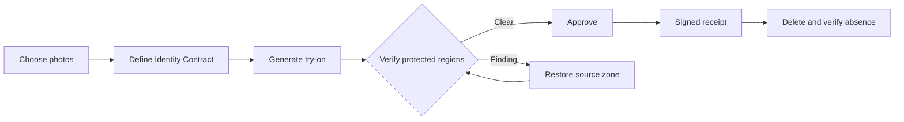
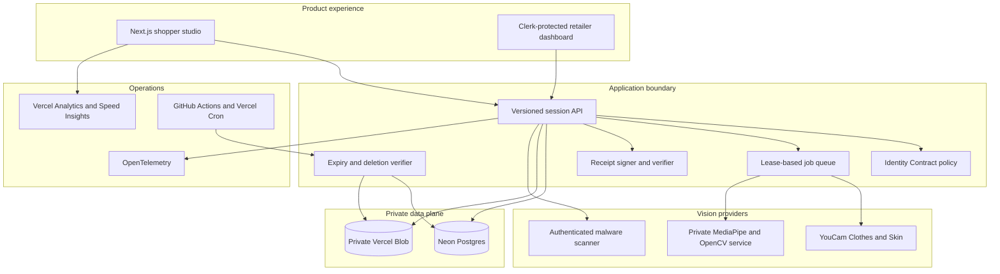

# KeepMe — Visual Integrity for Virtual Try-On

[](https://nodejs.org/)
[](https://nextjs.org/)
[](https://www.typescriptlang.org/)
[](https://github.com/ankitlade12/keepme/actions/workflows/ci.yml)
[](https://vercel.com/ankitlade12-3052s-projects/keepme)

> **Change the clothes, not the person.**

KeepMe is a consent and visual-integrity layer for AI apparel try-on. It lets a shopper define what may change, measures what actually changed, repairs supported violations, produces a signed receipt, and verifies deletion of the sensitive images used in the session.

The product is not an identity-verification or biometric-recognition system. It answers a narrower, useful question: **did the virtual try-on alter anything outside the shopper-approved garment area?**

## Product highlights

- **Identity Contract** — a versioned, generation-scoped record of the allowed edit and protected regions.
- **Preserve Map** — shopper-drawn zones for objects or details that must remain unchanged.
- **Measured integrity evidence** — garment fidelity, outside-region stability, face geometry, skin consistency, silhouette, and preserve-zone checks.
- **Hard failure rules** — critical protected-region drift cannot be hidden by a high average score.
- **Repair and reverification** — supported source regions can be restored and independently checked again.
- **Signed Integrity Receipt** — downloadable JWS evidence binds the approved contract to the result digests.
- **Verified deletion** — source, garment, generated, and repaired artifacts are deleted and then checked for absence.
- **Retailer-safe operations** — tenant isolation, minimum-cohort analytics, provider credit budgets, rate limits, and privacy-filtered telemetry.

## The product journey



The garment edit is expected. KeepMe evaluates the protected pixels and structures around it, explains any finding in plain language, and keeps the decision with the shopper.

## Recommended 90-second demo

The default **Identity drift demo** is synthetic, deterministic, and safe to repeat. It demonstrates KeepMe's value more clearly than waiting for a live provider to produce an accidental violation.

1. Open `/studio` and keep **Identity drift demo** selected.
2. Select **Protect the glasses** and review the pre-drawn preserve zone.
3. Approve the disclosed synthetic scenario and run the try-on.
4. Show the missing glasses, highlighted protected region, hard failure, and reason code.
5. Select **Restore source zone & reverify** and show the distinct repaired result.
6. Approve the result, download its signed receipt, then delete the session.

Verify the same journey without a browser:

```bash
npm run smoke:guided
```

## Product surfaces

| Surface | Route | Purpose |
|---|---|---|
| Product story | `/` | Shopper value, trust model, and retailer positioning |
| Safe try-on studio | `/studio` | Complete contract, generation, verification, receipt, and deletion journey |
| Retailer dashboard | `/dashboard` | Authenticated, tenant-scoped quality and usage aggregates |
| Health | `/api/health` | Dependency and runtime readiness without secret disclosure |
| Session API | `/api/v1/sessions` | Versioned privacy-first orchestration boundary |
| Receipt verification | `/api/v1/receipts/verify` | Independent signed-receipt verification |
| Public notices | `/privacy`, `/terms`, `/security` | Product privacy, terms, and security language |

The current Vercel deployment is a protected preview. It is suitable for team review, not public uploads. Production intentionally fails closed until every required dependency is configured.

## Architecture



### Integrity decision policy

| State | Meaning |
|---|---|
| `passed` | No protected check crossed its calibrated threshold |
| `needs_review` | A non-critical protected signal requires a shopper decision |
| `failed` | A hard protected-region rule was violated |
| `inconclusive` | Alignment or input quality is not reliable enough to judge |
| `passed_after_repair` | A supported source-zone restoration passed reverification |

Skin Analysis is a secondary consistency signal. If it is unavailable, confidence is reduced; the session does not fail automatically.

## Production foundation

| Layer | Implementation | Responsibility |
|---|---|---|
| Web and API | Next.js 16, React 19, TypeScript | Product UI, API boundary, security headers, and orchestration |
| Authentication | Clerk | Retailer sign-in and stable organization/user tenant ownership |
| Metadata and jobs | Neon Postgres | Sessions, cleanup leases, usage, rate limits, and privacy-filtered events |
| Sensitive artifacts | Private Vercel Blob | Opaque object paths, server-only access, digest evidence, and verified deletion |
| Virtual try-on | YouCam AI Clothes v3 | Server-side garment generation with bounded polling and credit guards |
| Consistency signal | YouCam Skin Analysis v2.1 | Optional source/result skin-signal comparison |
| Integrity worker | MediaPipe and OpenCV container | Face-landmark alignment and person segmentation without recognition |
| Upload boundary | Sharp plus scanner adapter | Byte decoding, size/pixel limits, metadata removal, re-encoding, and malware decision |
| Proof | JOSE, SHA-256, signed JWS | Contract/result binding and receipt verification |
| Operations | OpenTelemetry and Vercel | Structured runtime events, analytics, performance, and deployment visibility |

## Local quick start

Requirements: Node.js 22+ and npm.

```bash
git clone https://github.com/ankitlade12/keepme.git
cd keepme
npm ci
cp .env.example .env.local
npm run dev
```

Open <http://localhost:3000>. The guided demo needs no provider credentials and uses only the synthetic images under `public/demo/`.

### Live YouCam mode

Set the server-only `YOUCAM_API_KEY`, start the app, and select **Live virtual try-on** in `/studio`. The browser never receives the API key or upstream result URL.

The adapter uses the current YouCam routes:

- AI Clothes v3: `/s2s/v2.0/file/cloth-v3` and `/s2s/v2.0/task/cloth-v3`
- Skin Analysis v2.1: `/s2s/v2.1/file/skin-analysis` and `/s2s/v2.1/task/skin-analysis`

Live generation consumes provider units. Keep credentials in `.env.local` or encrypted hosting variables; never commit them.

## Verification

```bash
npm run lint              # ESLint and Next.js rules
npm test                  # integrity, receipt, upload, and UI unit tests
npm run build             # production compilation
npm run smoke:guided      # full synthetic contract-to-deletion flow
npm run audit:a11y        # automated WCAG A/AA route audit
npm run check:production  # fail-closed dependency and secret gate
npm run calibrate -- path/to/consented-evaluation.jsonl
```

GitHub Actions repeats dependency auditing, linting, unit tests, the production build, guided smoke testing, and accessibility checks on pull requests and `main`.

## Privacy and security model

- Images and derived artifacts are session-only and excluded from product analytics.
- Shopper consent is explicit, scoped to one generation, and represented in the contract.
- Individual shopper images are never exposed to the retailer dashboard.
- The app does not retain source filenames, create persistent face embeddings, infer demographics, or train on session images.
- Uploads are decoded from bytes, bounded to 10 MB and 24 MP, stripped of metadata, safely re-encoded, and sent to an authenticated scanner in fail-closed production.
- Mutation routes enforce same-origin requests; sensitive responses use `no-store`; CSP, HSTS, frame denial, MIME protections, and restrictive browser permissions are configured centrally.
- Scheduled cleanup recovers stale leases, retries bounded failures, deletes every artifact, and confirms absence before reporting success.

## Production release gates

KeepMe deliberately refuses to accept public personal images when a required control is missing. Before a public beta, operators must provide:

1. Clerk production keys and a reviewed retailer allowlist.
2. A production domain, privacy/security contacts, and reviewed legal notices.
3. An authenticated malware-scanning service suitable for private user images.
4. Production YouCam quota, rate policy, and rotated credentials.
5. A consented, governed calibration dataset with independent labels.
6. Human accessibility, security, processor, incident-response, and jurisdictional reviews.

Set `KEEPME_ALLOW_EPHEMERAL=false` and run `npm run check:production` before any public deployment. See the [production runbook](docs/production-runbook.md) for the complete release and incident procedure.

## Documentation

- [Architecture and integrity policy](docs/architecture.md)
- [Privacy and data lifecycle](docs/privacy.md)
- [Security review](docs/security-review.md)
- [Production runbook](docs/production-runbook.md)
- [Requirements traceability](docs/requirements-traceability.md)
- [Calibration protocol](calibration/README.md)

## Demo data and limitations

All images under `public/demo/` are synthetic and contain no real person or brand logo. The controlled violation is intentionally altered and labeled throughout the interface; it is not represented as a fresh YouCam failure.

KeepMe measures visual consistency. It does not verify a person's identity, infer sensitive traits, diagnose skin conditions, certify universal fairness, or guarantee garment fit. Thresholds must be calibrated on a consented evaluation dataset before real-world approval decisions are automated.
