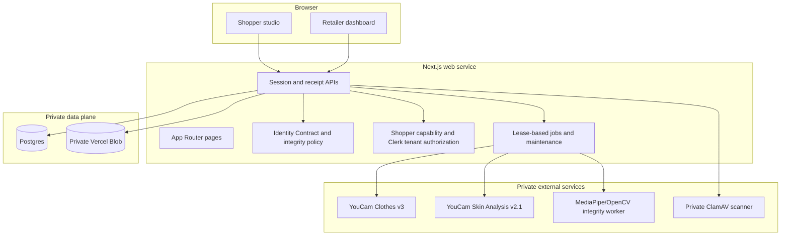
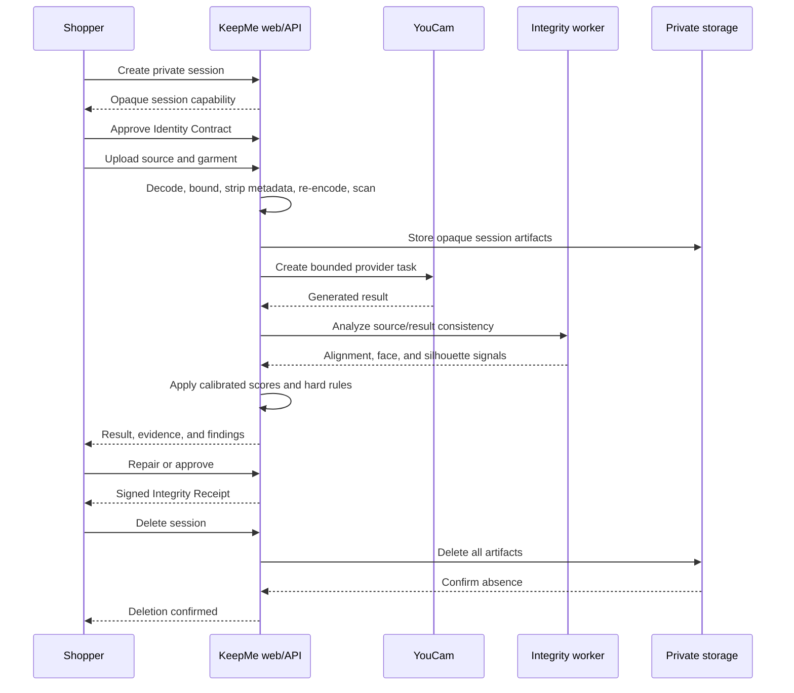

# Architecture and Integrity Policy

This document describes KeepMe’s implemented runtime, trust boundaries, integrity decisions, and production-only dependencies. For setup and the product walkthrough, start with the [project README](../README.md).

## Design Goals

KeepMe is designed around four rules:

1. The shopper defines the permitted edit before generation.
2. Protected-region evidence is evaluated before approval.
3. Critical findings override aggregate scores.
4. Sensitive artifacts remain session-scoped and are not declared deleted until their absence is verified.

The system measures visual consistency. It does not perform identity recognition, infer sensitive traits, or certify garment fit.

## Runtime Modes

| Mode | Inputs and providers | Persistence | Intended use |
|---|---|---|---|
| Guided | Synthetic committed fixtures; no provider call | Ephemeral adapters are allowed | Deterministic demo and CI smoke test |
| Local live | User-selected images and configured YouCam credentials | Ephemeral or durable adapters | Development against live provider APIs |
| Production | User-selected images and all configured private services | Postgres and private object storage required | Protected pilot only after every release gate passes |

The guided scenario intentionally removes the synthetic shopper’s glasses. The UI and API label it as a controlled fixture; it is not represented as an accidental live-provider failure.

## System Topology

On Vercel, [`vercel.json`](../vercel.json) deploys the web app, integrity worker, and ClamAV scanner as separate services. Private bindings inject `INTEGRITY_URL` and `MALWARE_SCAN_URL` into the web service at runtime. The root [`Dockerfile`](../Dockerfile) builds a non-root standalone Next.js image for other platforms.

## Session Lifecycle

Guided mode follows the same contract, decision, receipt, and deletion states but uses disclosed fixture artifacts and deterministic verification results.

## Component Responsibilities

| Component | Responsibility | Must not do |
|---|---|---|
| Studio UI | Collect inputs, contract choices, consent, and final decisions | Receive provider secrets or expose upstream result URLs |
| Session API | Enforce lifecycle, authorization, rate limits, and response policy | Trust client-supplied tenant ownership |
| Upload boundary | Decode bytes, enforce JPEG/PNG and size limits, strip metadata, scan | Execute uploaded content or preserve original filenames |
| Malware scanner | Authenticate requests and inspect reconstructed image bytes with ClamAV | Accept browser traffic directly or treat an unavailable engine as clean |
| YouCam adapter | Upload, create tasks, poll with bounds, record usage | Start unbounded or duplicate provider work |
| Integrity engine | Combine measured signals, hard rules, and confidence | Convert unreliable evidence into a pass |
| Integrity worker | Measure face-landmark and silhouette stability | Recognize identity or persist embeddings |
| Receipt service | Bind contract/result digests and sign the final record | Include raw image data or provider credentials |
| Cleanup worker | Claim expiry jobs, delete artifacts, and verify absence | Report success before every configured store confirms deletion |
| Retailer analytics | Return tenant-scoped, privacy-filtered aggregates | Expose individual shopper images or small cohorts |

## Integrity Decision Policy

The integrity engine produces one of five states:

| State | Decision rule |
|---|---|
| `inconclusive` | Alignment or input evidence is not reliable enough for a defensible decision |
| `failed` | A critical preserve-zone or other hard protected-region rule is violated |
| `needs_review` | A non-critical signal crosses its review threshold |
| `passed` | No critical finding exists and the calibrated summary passes |
| `passed_after_repair` | A supported source-zone restoration passes independent reverification |

Hard rules take precedence over the weighted summary. A high average score cannot hide a critical preserve-zone change. Skin Analysis is a secondary signal: if it is unavailable, confidence is reduced rather than automatically failed.

Threshold profiles are versioned. Production thresholds require a governed, consented, independently labeled evaluation dataset; see the [calibration protocol](../calibration/README.md).

## Data Ownership and Isolation

- Shopper sessions use an opaque, high-entropy capability stored in an HttpOnly, SameSite=Strict cookie.
- Retailer access uses Clerk and a stable active-organization or user tenant identifier.
- Authorization is enforced at each session or tenant data access.
- Unknown and unauthorized session IDs return the same 404 response shape.
- Postgres rows carry tenant/session ownership, while object paths are opaque and server-only.
- The retailer dashboard uses aggregate, privacy-filtered events and suppresses cohorts smaller than the configured minimum.

See [privacy and data handling](privacy.md) for the artifact lifecycle and [security review](security-review.md) for the threat model.

## Reliability and Cleanup

- Provider polling is bounded and guarded by per-session and per-tenant credit limits.
- Job claims use leases and recover stale work after crashes.
- Cleanup retries are bounded and preserve failure state for operator review.
- An authenticated external scheduler can invoke the maintenance route at the cadence required by the session TTL.
- The included Vercel Cron invokes the same route daily as a fallback; a higher-frequency workflow is an operator responsibility.
- The health route reports `ok` or `degraded` and distinguishes ephemeral from durable adapters without returning secrets.

Webhook completion is preferred if a provider supports it reliably; the current adapter uses bounded polling.

## Observability

KeepMe registers OpenTelemetry as `keepme-web` and emits structured, privacy-filtered operational events. Events may include category, reason code, duration, counts, session/tenant identifiers, and provider-unit totals. They must not include image bytes, image URLs, original filenames, free-form shopper descriptions, credentials, or inferred identity attributes.

Vercel Web Analytics and Speed Insights observe product navigation and performance only. Sensitive session artifacts are excluded from analytics payloads.

## Implementation Boundary

Implemented in the repository:

- Responsive guided and live studio flows
- Identity Contract schema, controls, consent, and Preserve Map
- Five-state integrity engine, hard rules, fixtures, and unit tests
- YouCam Clothes v3 and Skin Analysis v2.1 server adapters
- Private result proxy, source-zone repair, and reverification
- Signed receipt creation, download, and verification
- Postgres, private object-store, job, event, usage, and rate-limit adapters
- Ephemeral local fallbacks for the synthetic demo
- Clerk retailer authentication and tenant isolation
- Upload decoding, metadata stripping, re-encoding, and private authenticated ClamAV service
- Private MediaPipe/OpenCV integrity service
- Cleanup, deletion verification, health checks, CI, and operational configuration

Required before public personal-image traffic:

- Production credentials, quotas, private stores, domain, and monitoring destination
- Credential rotation, backup/restore testing, deletion drills, and incident ownership
- Governed calibration data and frozen reviewed thresholds
- Independent accessibility, penetration, upload-parser, authorization, and tenant-isolation testing
- Vendor/processor agreements and jurisdiction-specific privacy/legal review

## Related Documentation

- [Project overview and setup](../README.md)
- [Privacy and data handling](privacy.md)
- [Security review](security-review.md)
- [Production runbook](production-runbook.md)
- [Requirements traceability](requirements-traceability.md)
- [Calibration protocol](../calibration/README.md)
