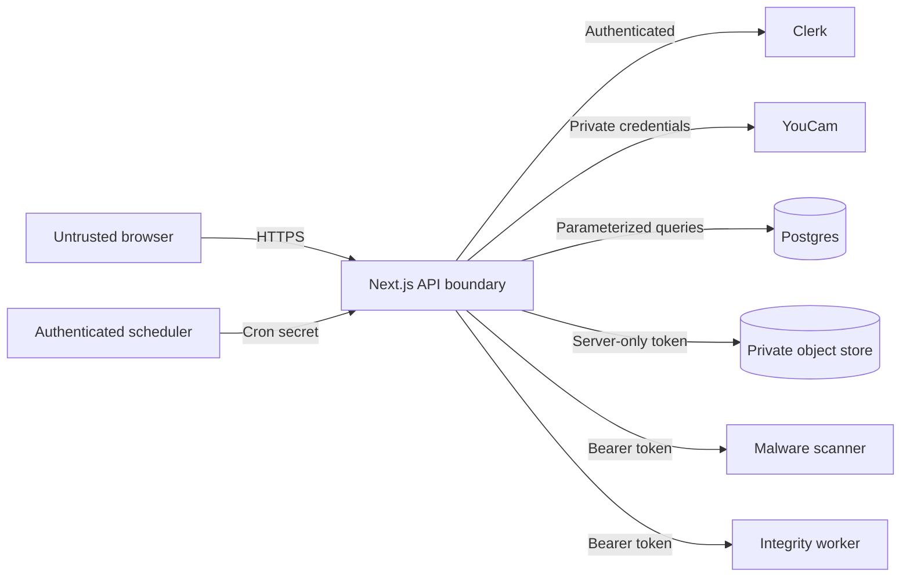

# Security Review

This review summarizes KeepMe’s current application controls, trust boundaries, known gaps, and required operational validation. It is a living engineering document, not a certification or completed penetration-test report.

## Security Objectives

KeepMe must:

- prevent unauthorized access to shopper sessions and retailer tenants;
- keep provider and infrastructure credentials server-side;
- treat uploaded media and external responses as untrusted;
- prevent sensitive artifacts from entering logs or analytics;
- contain provider cost and resource abuse;
- bind approved contracts to verifiable result evidence;
- delete session artifacts reliably and report failures truthfully.

## Assets

| Classification | Examples |
|---|---|
| Sensitive session data | Source, garment, generated/repaired images, crops, masks, heatmaps, preserve zones, consent record |
| Security-sensitive metadata | Opaque session capability, provider file/task references, object paths, receipt payloads |
| Server-only secrets | YouCam, Clerk, Postgres, Blob, scanner, worker, cron, and receipt-signing credentials |
| Tenant data | Retailer organization/user ID, aggregate events, provider usage, CSV exports |
| Public data | Controlled synthetic fixtures, product pages, bounded health response, receipt submitted by its holder |

## Trust Boundaries

Every arrow crossing the web/API boundary requires validation, authorization, bounded input, and privacy-filtered observability.

## Implemented Controls

### Session and Tenant Authorization

- Opaque, high-entropy shopper capability in an HttpOnly, SameSite=Strict cookie; `Secure` is enabled in production.
- Clerk authentication for retailer routes.
- Exact retailer email allowlist.
- Stable active-organization or user ID as the tenant owner.
- Authorization at every session/tenant data access.
- Identical 404 behavior for unknown and unauthorized session IDs.

### Request and Browser Security

- Same-origin checks on mutation routes.
- Content Security Policy with narrowly scoped Clerk, Cloudflare, and Vercel telemetry origins.
- `frame-ancestors 'none'` and `X-Frame-Options: DENY`.
- MIME sniffing denial, strict referrer policy, restrictive browser permissions, COOP/CORP, and HSTS.
- `Cache-Control: no-store` on sensitive responses.
- Server-only provider credentials and private result proxying.

### Upload Security

- JPEG/PNG allowlist validated from decoded bytes rather than filename alone.
- 10 MB upload and 24 MP decoded-image limits.
- Generated internal filenames; original names are not used as identity metadata.
- Metadata stripping and safe image re-encoding with Sharp.
- Authenticated scanner adapter; scanning is mandatory when production runs fail closed.
- Uploaded content is never executed.

### Storage and Database

- Private Vercel Blob access with opaque object paths.
- SHA-256 digests for evidence binding.
- Deletion followed by absence verification.
- Tenant/session columns in Postgres and parameterized SQL access.
- Bounded connection pool.
- Durable expiry jobs with bounded retries and `SKIP LOCKED` claims.
- Runtime and migration roles can be separated; automatic migration is disabled by default.

### Abuse and Cost Controls

- Per-IP session limits.
- Per-session upload and provider-task limits.
- Per-tenant hourly provider budgets.
- Bounded provider polling and no automatic duplicate task creation after timeout.
- Authenticated maintenance and integrity-worker endpoints.

### Proof and Observability

- Receipts bind contract/result digests in a signed JWS.
- Receipt payloads can be submitted to a separate verification endpoint.
- Structured events exclude image data, secrets, identity attributes, original filenames, and URLs.
- OpenTelemetry, runtime logs, Vercel Analytics, and Speed Insights are configured without sensitive artifact payloads.

## Threat Review

| Threat | Current mitigation | Remaining validation |
|---|---|---|
| Session enumeration | High-entropy capabilities and uniform 404 responses | External authorization test |
| Cross-tenant access | Clerk tenant binding and per-query ownership | Independent tenant-isolation test |
| CSRF/cross-origin mutation | Same-origin validation and strict cookies | Browser-based negative test across supported origins |
| Malicious image/parser abuse | Decode limits, format allowlist, re-encoding, scanner adapter | Adversarial image corpus and scanner outage drill |
| Stored or reflected script injection | React escaping, CSP, bounded schemas, no free-form analytics | DAST and manual CSP review |
| Provider credential exposure | Server-only environment variables and result proxy | Secret scan and response inspection |
| SSRF through provider/result URLs | Server-controlled endpoints and adapter boundaries | Dedicated SSRF test against redirects/DNS changes |
| Provider cost exhaustion | Rate limits, credit budgets, bounded polling | Load test and budget-alert drill |
| Deletion falsely reported | Absence verification and retryable cleanup state | Storage-versioning and disaster-recovery deletion drill |
| Receipt tampering | JWS verification and digest binding | Key rotation and replay policy review |
| Sensitive logging | Structured allowlisted fields | Log-drain sampling and red-team review |

## Production Gaps

The repository includes controls and adapters, but the following evidence cannot be produced by code alone:

- configured MFA and least-privilege roles across hosting, database, storage, GitHub, Clerk, YouCam, scanner, and monitoring accounts;
- rotated production secrets and a documented signing-key rotation/revocation policy;
- tested backups and restores that honor the privacy and deletion policy;
- independent SAST, DAST, dependency, container, authorization, SSRF, CSRF, upload-parser, and tenant-isolation testing;
- incident response, vulnerability intake, processor agreements, breach notification, and data-subject request procedures;
- jurisdiction-specific privacy, consumer, accessibility, and retailer-contract review.

The protected preview must not be treated as evidence that these production controls are complete.

## Release Security Checklist

- [ ] `npm audit --omit=dev --audit-level=high` passes or every exception is documented.
- [ ] `npm run lint`, `npm test`, `npm run build`, `npm run smoke:guided`, and `npm run audit:a11y` pass.
- [ ] `KEEPME_ALLOW_EPHEMERAL=false npm run check:production` passes in the deployment environment.
- [ ] Production credentials are unique, rotated, encrypted at rest, and scoped to the minimum role.
- [ ] Database and object storage deny public access.
- [ ] Scanner and integrity-worker requests reject missing or invalid authentication.
- [ ] Retailer allowlist and tenant boundaries are reviewed with test accounts.
- [ ] Rate limits, provider budgets, and alert thresholds are tested.
- [ ] Cleanup, failed-deletion, backup/restore, and credential-revocation drills are recorded.
- [ ] Legal notices, privacy/security contacts, vendor terms, and incident ownership are approved.

## Reporting a Security Issue

Do not include personal images, credentials, provider URLs, or exploit data in a public issue. Use the private security contact configured by the deployment operator. A public production release must publish that contact before accepting personal-image traffic.

## Related Documentation

- [Project overview](../README.md)
- [Architecture and integrity policy](architecture.md)
- [Privacy and data handling](privacy.md)
- [Production runbook](production-runbook.md)
- [Requirements traceability](requirements-traceability.md)
